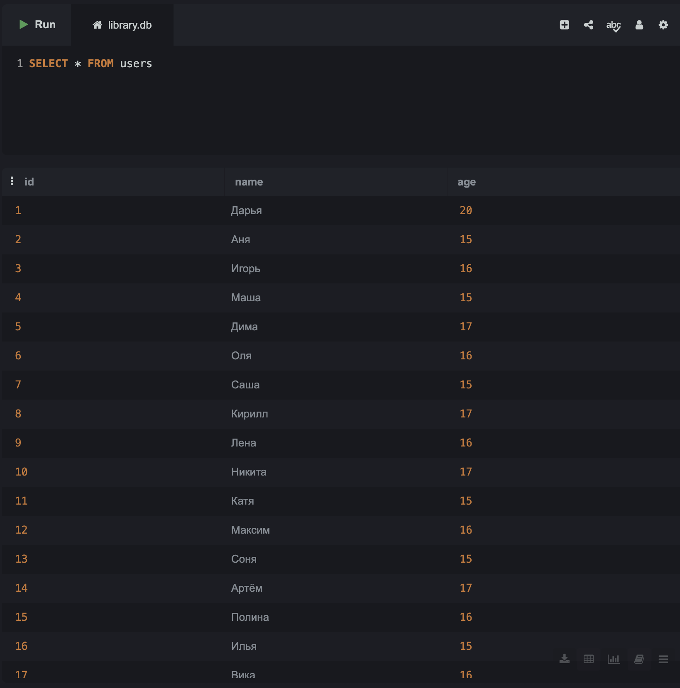
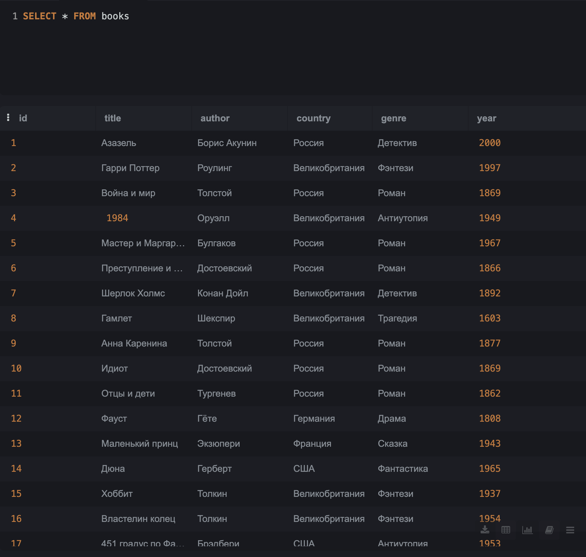
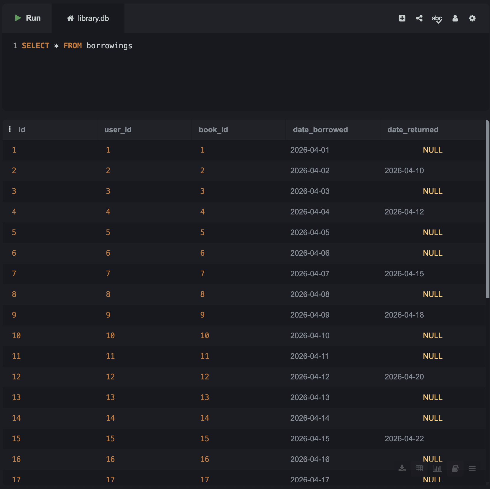

# **Тестовый проект по основам работы с базой данных "Библиотека""**

*Данный репозиторий создан в учебных целях.*
*Он используется для демонстрации работы с БД и SQL в рамках методических материалов.*

---

## Цель проекта

Основные цели:

1. Научиться проектировать базы данных
2. Научиться создавать таблицы
3. Отработать заполнение БД записями разными способами: вручную, пользовательским вводом и комбинациями
4. Научиться оформлять свои проекты

---

## Структура базы данных

База данных состоит из следующих таблиц:
1. Таблица пользователей библиотеки:
   - id 
   - имя
   - возраст
2. Таблиц книг, имеющихся в библиотеке:
   - id
   - название  
   - автор
   - жанр
   - год издания
3. Таблица, отображающая какой пользователь какую взял книгу:
   - id операции
   - id пользователя
   - id книги
   - дата взятия книги  
   - дата возврата книги
   
---

## Отображение в интерфейсе SQL
### Каждая таблица заполнена не менее 30 записями
#### Таблица users

#### Таблица books

#### Таблица borrowings

